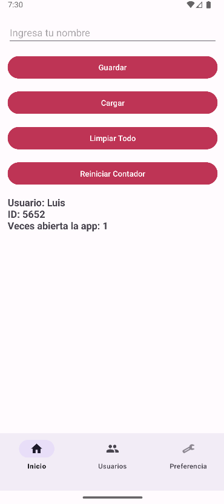
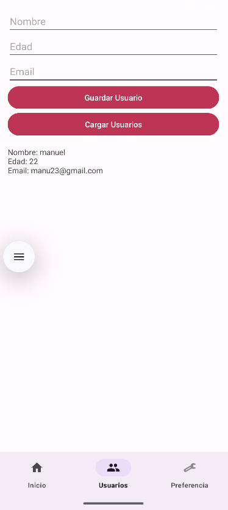
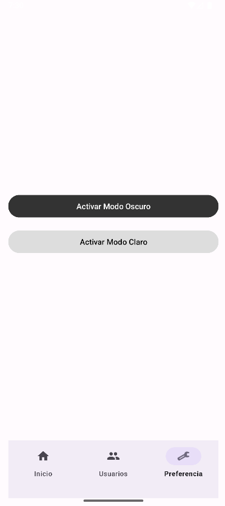
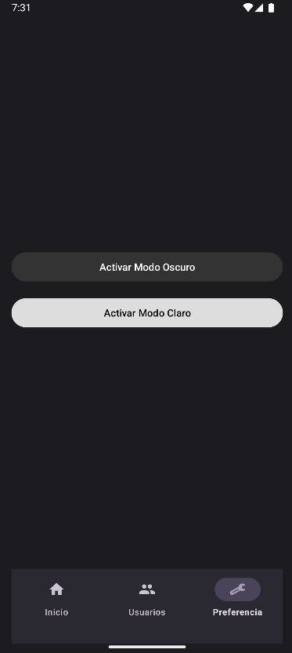
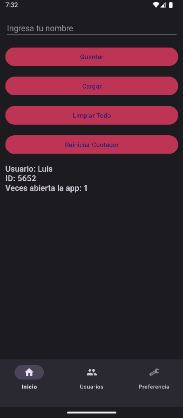

# 📱 App S9 - Registro de Usuario y Preferencias

Esta aplicación Android permite a los usuarios:
- Guardar su nombre e ID de usuario aleatorio.
- Contar cuántas veces se ha abierto la app.
- Reiniciar el contador.
- Ver usuarios almacenados.
- Cambiar el tema entre claro y oscuro (modo noche).
- Navegar entre secciones mediante una barra de navegación inferior.
- Borrar todas las preferencias, datos almacenados.

## 🚀 Características Principales

### 👤 Registro de Usuario
- Guarda el nombre del usuario.
- Genera un ID aleatorio entre 1000 y 9999.
- Almacena la información en `SharedPreferences`.

### 📊 Contador de Apertura de la App
- Aumenta **una sola vez por sesión** al abrir la aplicación.
- Se muestra visualmente cuántas veces se ha abierto.
- Opción para **reiniciar** el contador manualmente.

### 🌗 Modo Claro / Oscuro
- Guarda la preferencia del tema usando `SharedPreferences`.
- Se aplica automáticamente en futuros inicios.

### 📂 Persistencia de Datos
- Usa `SharedPreferences` para almacenar y recuperar:
  - Nombre de usuario
  - ID de usuario
  - Contador de aperturas
  - Preferencia de tema
  - Estado de sesión

### 🔄 Navegación Inferior (Bottom Navigation View)
- `Inicio`: pantalla principal con formulario y contador.
- `Usuarios`: lista de usuarios registrados.
- `Preferencias`: selector de tema (claro / oscuro).
